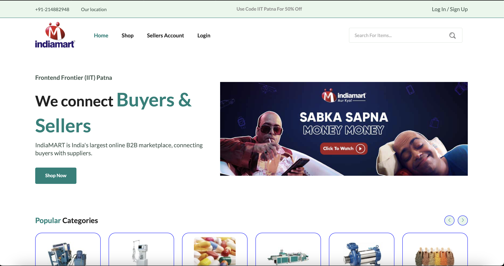
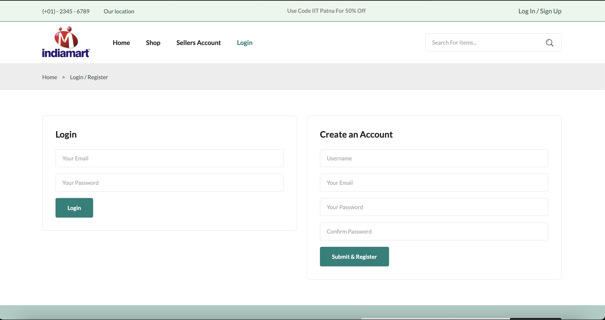
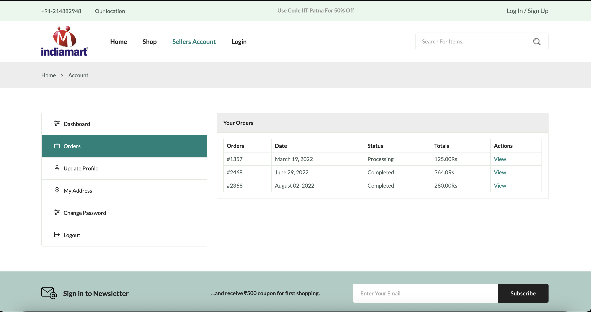
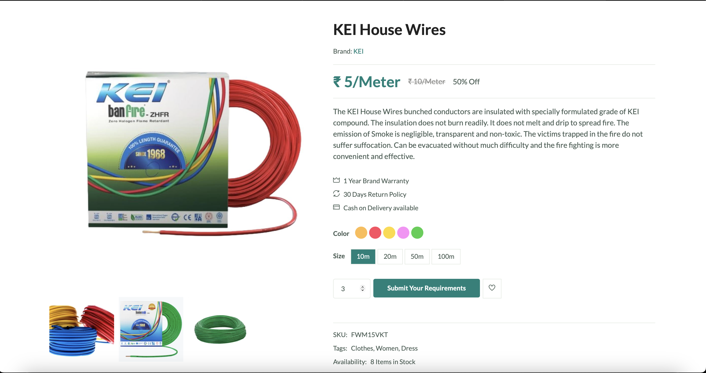
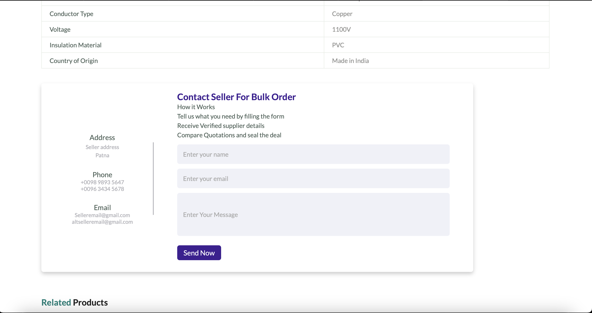

# Frontend-Frontier
=======
# A-Responsive-Ecommerce-Website-Project
A Responsive Ecommerce Website Project With HTML CSS JavaScript
# IndiaMART Revamped Frontend  

## Demo
[View Demo](https://frontend-frontier.vercel.app/shop.html)

## 📌 Overview  
This project is a redesigned and modernized version of the IndiaMART website's frontend. The aim is to improve user experience, enhance UI/UX, and optimize performance using the latest web technologies.  

## 🚀 Features  
- Responsive design for mobile and desktop  
- Improved navigation and user experience  
- Enhanced product listing and search functionality  
- Optimized performance and loading speed  
- Modern UI components and styling  

## 🛠️ Tech Stack  
- **Frontend**: HTML, CSS, JavaScript   
- **Styling**: Bootstrap 

## 📂 Installation & Setup  
To run this project locally, follow these steps:  

1. **Clone the repository:**  
   ```bash
   git clone https://github.com/YuvrajHarsh04/Revamp-IndiaMART.git
   cd Revamp-IndiaMART

## 📸 Screenshots  
##Explore Page


## Login/Signup

 

## Sellers' Page

 

## Product Detail Page

 

## Contact Seller Form

 

---

## 📬 Contact  

For any queries or suggestions, feel free to reach out:  
📧 **Email:** [musicworld4960@gmail.com](mailto:musicworld4960@gmail.com)  
🔗 **GitHub:** [YuvrajHarsh04](https://github.com/YuvrajHarsh04)  

